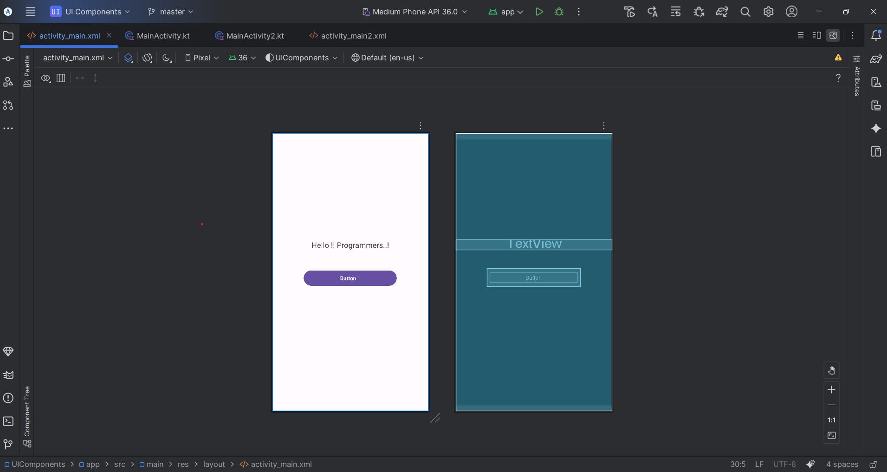
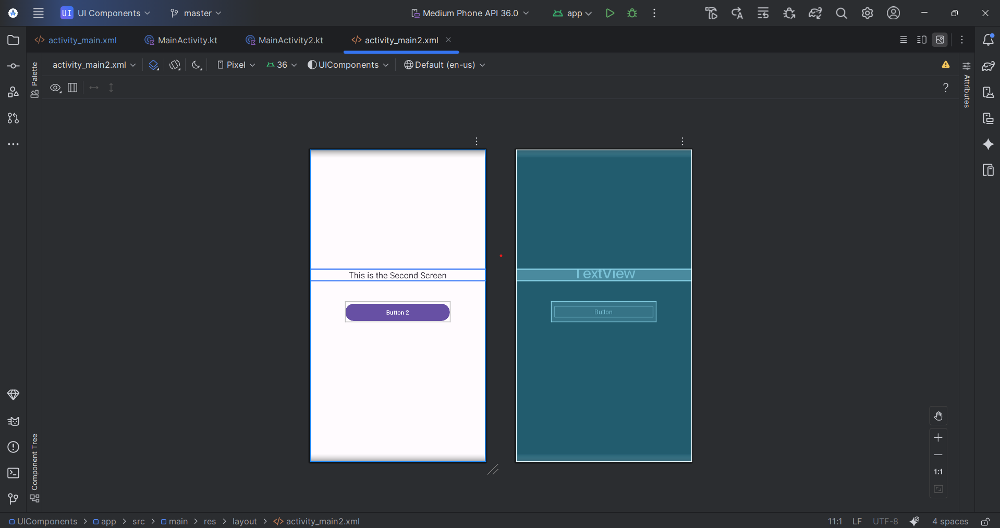

# 🚀 Android UI Components – Toast Example

This project demonstrates the **basics of Android UI development** using **LinearLayout, TextView, and Button**.  
It also explains **two different methods of handling Button clicks** in Kotlin:

1. ✅ **Without `lateinit`** → Using direct initialization with `findViewById`.  
2. ✅ **With `lateinit`** → Declaring the Button with `lateinit` and initializing it later.

---

## 📱 Features
- Clean UI with **LinearLayout**.
- **TextView** displaying messages.
- Two buttons with Toast messages.
- Demonstrates both **`var` initialization** and **`lateinit` property**.
- Beginner-friendly Kotlin code for Android Studio.

---

## 🛠 Tech Stack
- **Language:** Kotlin  
- **IDE:** Android Studio  
- **UI Design:** XML Layouts  
- **Android Components:** LinearLayout, TextView, Button, Toast  

---

## 📂 Project Structure

├── app/src/main/java/com/example/uicomponents/

│ ├── MainActivity.kt # Button without lateinit

│ └── MainActivity2.kt # Button with lateinit

│
├── app/src/main/res/layout/

│ ├── activity_main.xml # Layout for MainActivity

│ └── activity_main2.xml # Layout for MainActivity2

│
└── AndroidManifest.xml


---

## 📸 Screenshots
👉 *(Add your app screenshots here to make it visual & professional)*  

| MainActivity (Button 1) | MainActivity2 (Button 2) |
|--------------------------|--------------------------|
|  |  |

---

## 🚀 How to Run
1. Clone this repository:
   ```bash
   git clone https://github.com/your-username/Android-UIComponents-ToastExample.git

2. Open in Android Studio.

3. Run on an emulator or physical device.
